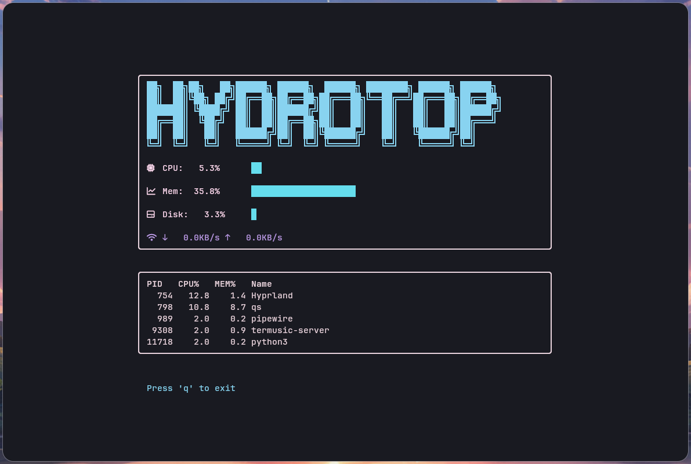

  

    
  

  
Hydrotop é um monitor de sistema para terminal, escrito em Python, que exibe em tempo real métricas essenciais de hardware e processos, com uma interface TUI (Text User Interface) estilizada utilizando <code>curses</code>.

---

  <h2>Funcionalidades</h2>
  <ul>
    <li>Monitoramento de uso de CPU, memória RAM e disco.</li>
    <li>Visualização da taxa de transferência de rede (download e upload).</li>
    <li>Exibição dos processos mais consumidores de CPU.</li>
    <li>Interface com caixas desenhadas em ASCII e uso de símbolos Nerd Fonts.</li>
    <li>Atualização dinâmica a cada segundo.</li>
    <li>Suporte a redimensionamento mínimo do terminal.</li>
  </ul>

  

  <h2>Preview</h2>

    

  <h2>Requisitos</h2>
  <ul>
    <li>Python 3.6 ou superior</li>
    <li>Biblioteca <code>psutil</code> (para coleta das métricas do sistema)</li>
    <li>Terminal compatível com <code>curses</code> (Linux, macOS, WSL)</li>
  </ul>
  
Instalação do <code>psutil</code>:

  <pre>pip install psutil</pre>

  

  <h2>Uso</h2>
  
Execute o script diretamente pelo terminal:

  <pre>python3 hydrotop.py</pre>
  
Pressione <code>q</code> para sair da aplicação.

  

  <h2>Estrutura do Código</h2>
  <ul>
    <li>Uso da biblioteca <code>curses</code> para criar a interface interativa.</li>
    <li>Funções para desenhar caixas e barras de progresso coloridas.</li>
    <li>Loop principal que atualiza as métricas em tempo real.</li>
    <li>Tratamento para evitar erros ao desenhar em terminais pequenos.</li>
  </ul>

  

  <h2>Considerações</h2>
  
Hydrotop está na versão alpha e pode sofrer alterações. Sugestões e contribuições são bem-vindas via issues ou pull requests no repositório.

  

  <h2>Contato</h2>
  
Para dúvidas ou sugestões, abra uma issue ou entre em contato via email.

  

    
  

</body>
</html>
