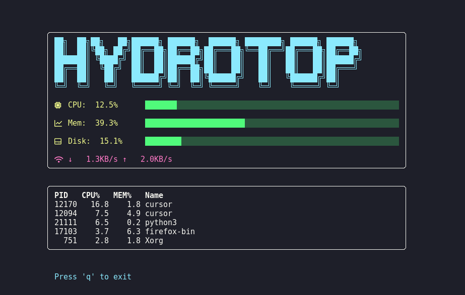

<h1 align="center">HydroTop</h1>

<p align="center">
  <b>HydroTop</b> is a modern, real-time system monitor for the terminal, written in Python.<br>
  It displays essential hardware metrics and process information through a stylish Text User Interface (TUI) powered by <code>curses</code>.<br>
  HydroTop brings together clarity, aesthetics, and performance monitoring into a single, easy-to-use tool.
</p>

---

## Features

- **CPU, Memory, and Disk Monitoring:**  
  View real-time usage statistics of your system's CPU, RAM, and disk.
- **Network Throughput Display:**  
  Monitor current download and upload speeds.
- **Top Resource-Consuming Processes:**  
  Instantly see which processes are using the most CPU.
- **Elegant TUI with ASCII Boxes & Nerd Font Icons:**  
  Visually appealing interface with box-drawing characters and Nerd Font symbols for intuitive status visualization.
- **Live Updates:**  
  All metrics refresh every second for up-to-date monitoring.
- **Responsive Design:**  
  Auto-detects terminal resizing and provides feedback if the window is too small.

---

## Preview

<p align="center">
  
</p>

---

## Requirements

- **Python**: Version 3.6 or higher
- **psutil**: For system metrics collection
- **curses**: Terminal interface (native on Linux/macOS/WSL)

> **Note:** Officially supported on Linux, macOS, and WSL.  
> Windows users may try running HydroTop with the `windows-curses` package, but compatibility and support are **not guaranteed**.

### Install dependencies:

```bash
pip install psutil
```
If on Windows:
```bash
pip install windows-curses
```

---

## Usage

Run the script directly from your terminal:

```bash
python3 hydrotop.py
```

- Press `q`, <kbd>Esc</kbd>, or <kbd>Ctrl+C</kbd> to exit HydroTop at any time.

---

## Code Structure

- **Interactive Interface:**  
  Built using the `curses` library for smooth and responsive TUI.
- **Drawing Utilities:**  
  Functions for rendering boxes and colored progress bars.
- **Metrics Loop:**  
  Main event loop gathers and updates system data every second.
- **Error Handling:**  
  Gracefully manages drawing errors on small terminals.
- **Keyboard Controls:**  
  Quick exit via keyboard shortcuts for convenience.

---

## Contributing

HydroTop is considered stable and open to improvements.  
Contributions and suggestions are welcome via [issues](https://github.com/Henriquehnnm/HydroTop/issues) or [pull requests](https://github.com/Henriquehnnm/HydroTop/pulls).

---

## Contact

For questions, bug reports, or feature requests, please [open an issue](https://github.com/Henriquehnnm/HydroTop/issues) or contact via email.
